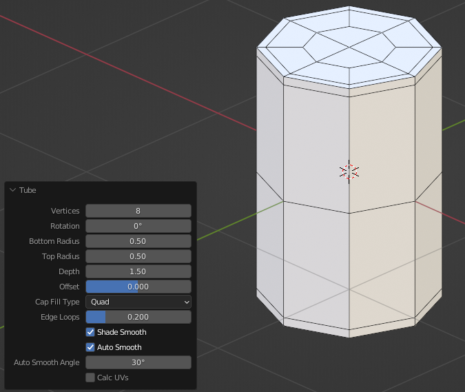
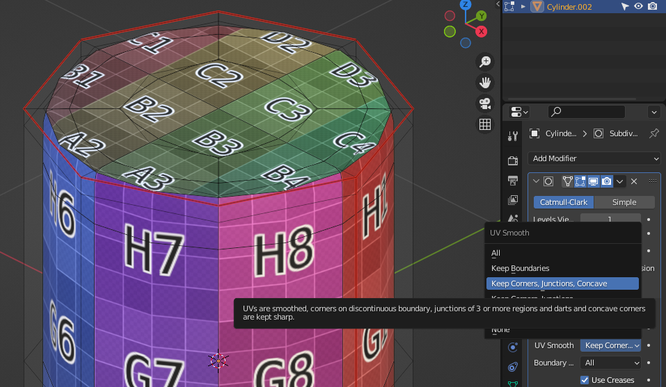

This extension aims to provide a cylinder primitive that is friendlier to subdivision surface modelling than the default. It was created in response to the tutorial video, "[Blender - A better cylinder - #5 Subdivision Surface Modelling in Blender](https://youtu.be/pWOh9cWwYqU)," by [Ian McGlasham](https://www.youtube.com/@ianmcglasham).

A key difference between this cylinder and the one in the video above is that grid fill is not used on end caps. If an end cap has an even number of sectors and the `"QUAD"` type is selected, then a quadrilateral fan will be used. For a cylinder with 8 sectors, as McGlasham uses, the result is the same as a grid fill.

For UV coordinates, this extension matches the default cylinder. It is recommended to adjust the UV Smooth properties of the subdivision surface modifier to avoid distortion. See the [manual entry](https://docs.blender.org/manual/en/latest/modeling/modifiers/generate/subdivision_surface.html) for more information.